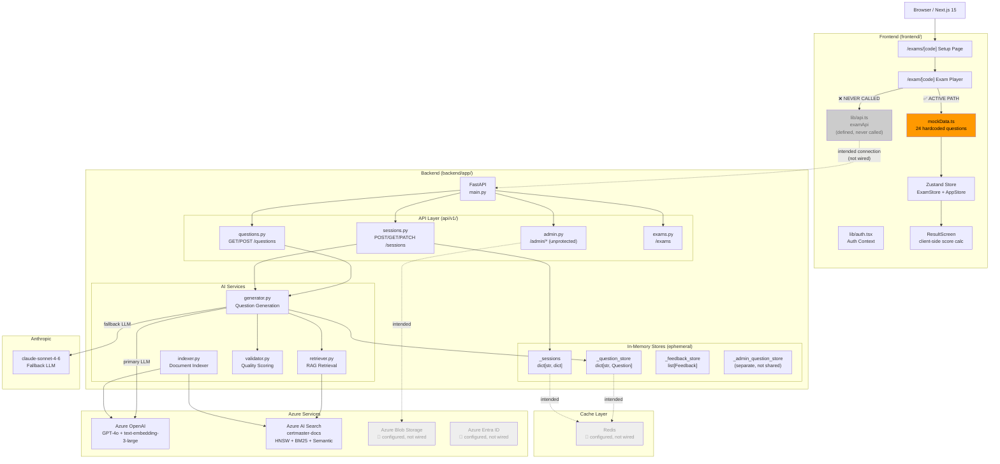
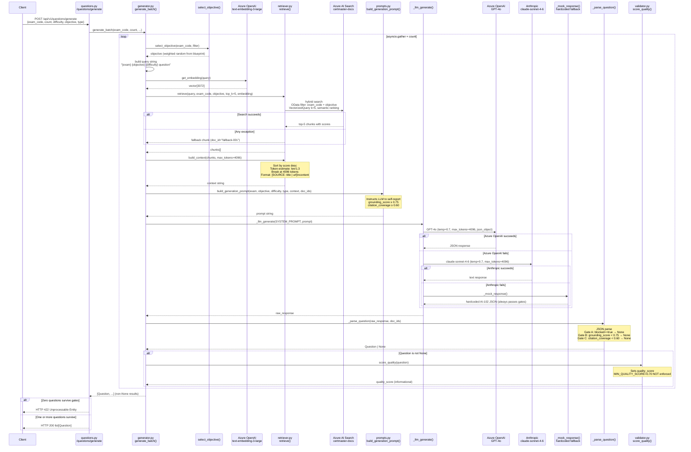
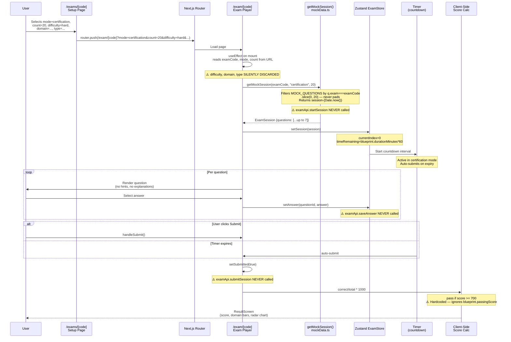
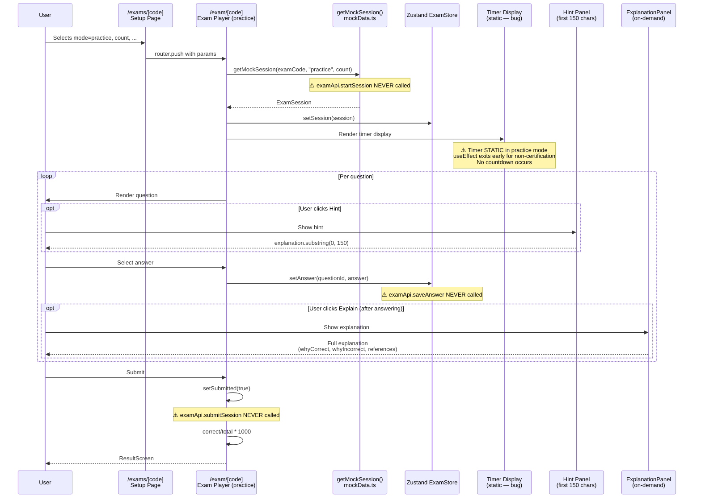
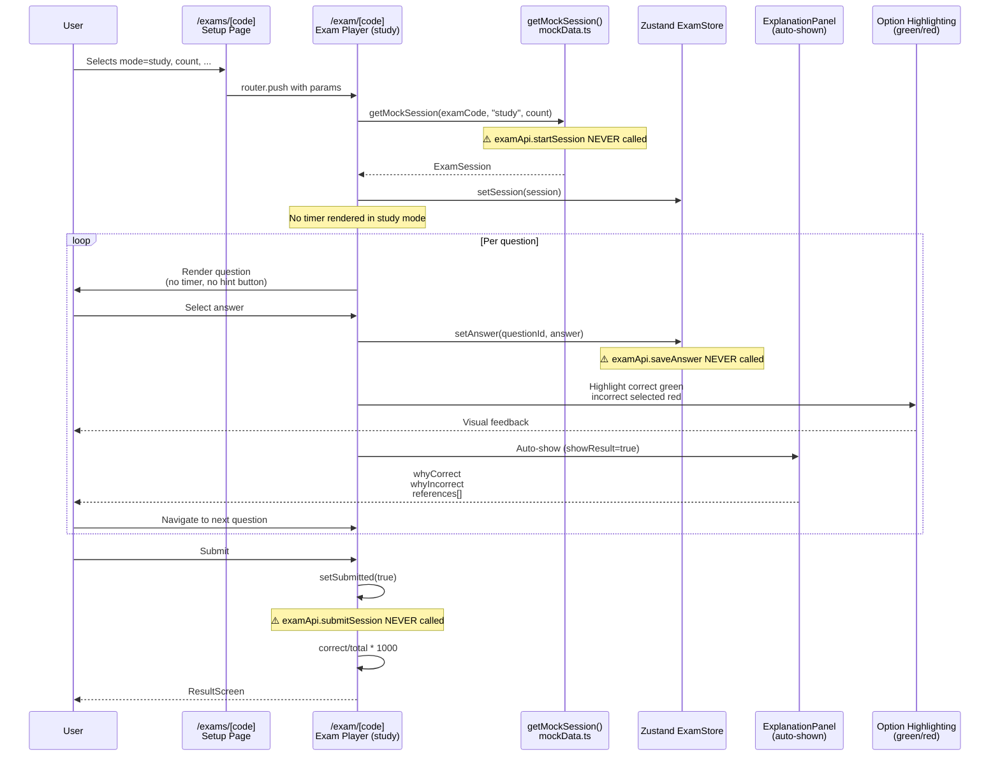
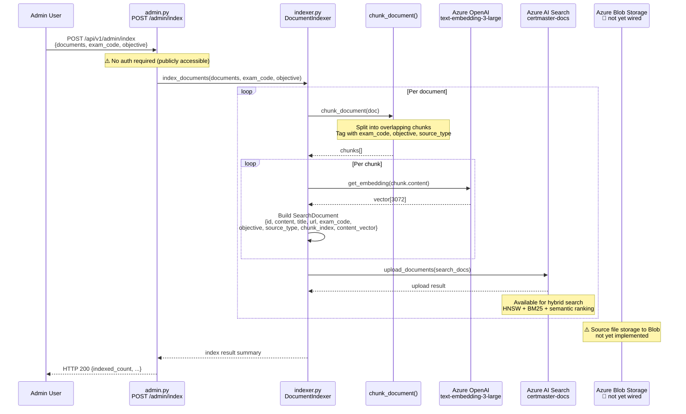
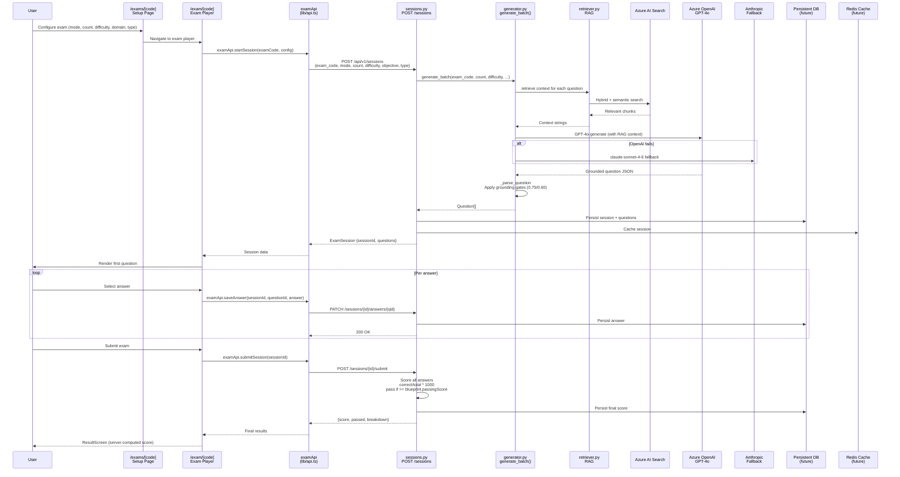
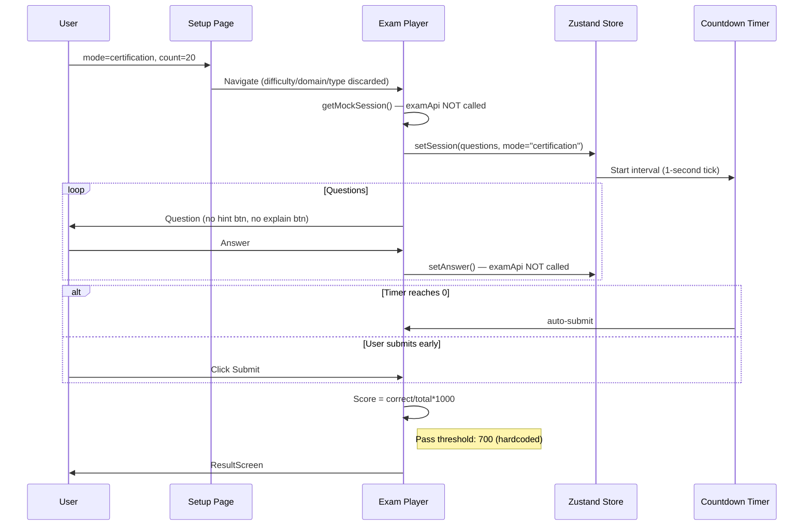
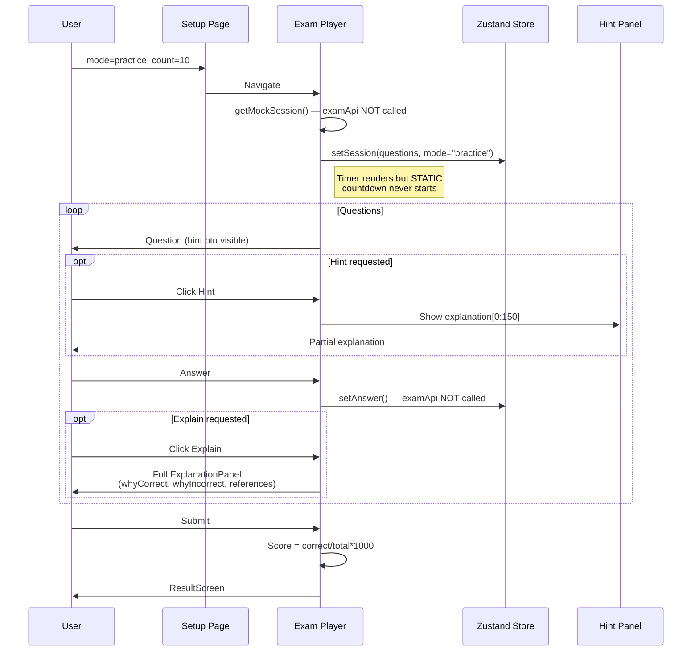
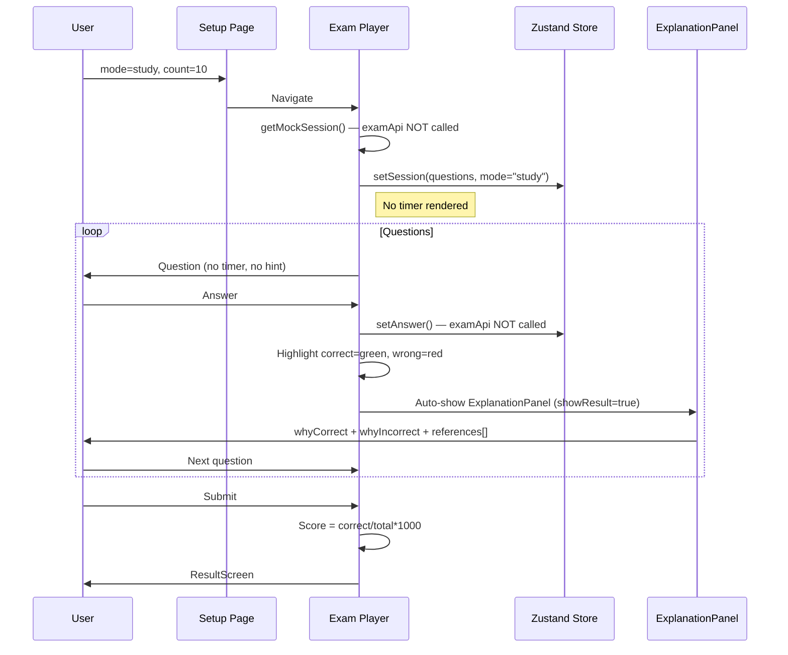

# CertMasterAI — Flow Diagrams

> Generated: 2026-08-12 | Mermaid diagrams — render in GitHub, VS Code, or mermaid.live

---

## Diagram A — High-Level System Architecture

---

## Diagram B — Question Generation Flow

---

## Diagram C — Mock Exam Mode Flow (Certification)

---

## Diagram D — Practice Mode Flow

---

## Diagram E — Study Mode Flow

---

## Diagram F — Knowledge Ingestion Flow (Intended / Admin)

---

## Diagram G — Intended Full Flow (When Backend Connected)

> This diagram shows the target architecture when the frontend is wired to the real API.

---

## Sequence Diagrams — All Three Exam Modes (Detailed)

### Certification Mode (Detailed)

### Practice Mode (Detailed)

### Study Mode (Detailed)

---

## Current vs Intended Architecture

| Component | Current Behavior | Intended Behavior |
|-----------|-----------------|-------------------|
| **Exam session creation** | `getMockSession()` from `mockData.ts` | `POST /api/v1/sessions/` → generate N questions via RAG + LLM |
| **Question source** | 24 hardcoded questions in `mockData.ts` | LLM-generated, grounded in Azure AI Search corpus |
| **Difficulty filter** | Discarded silently | Passed to `generate_batch()` → influences objective selection and prompt |
| **Domain filter** | Discarded silently | Passed as `objective_filter` → OData filter on AI Search |
| **Question type filter** | Discarded silently | Passed to `generate_batch()` → enforced in generation prompt |
| **Answer saving** | Zustand local state only | `PATCH /api/v1/sessions/{id}/answers/{qid}` → persisted to DB |
| **Session submission** | `setSubmitted(true)`, client-side score | `POST /api/v1/sessions/{id}/submit` → server-computed score |
| **Score calculation** | `correct/total*1000`, hardcoded pass=700 | Server-side, uses `blueprint.passingScore` |
| **Practice mode timer** | Static display, never counts down | Active count-up or countdown with configurable behavior |
| **Auth header** | Always absent (key mismatch) | JWT Bearer from correct localStorage key or httpOnly cookie |
| **Admin endpoint protection** | Publicly accessible | Requires admin JWT role |
| **Question persistence** | In-memory dict (lost on restart) | DB-backed (SQLAlchemy + PostgreSQL) |
| **Session persistence** | In-memory dict (lost on restart) | DB-backed + Redis cache |
| **Grounding verification** | LLM self-report only | Independent citation coverage recomputation |
| **Duplicate detection** | `check_duplicate()` implemented but never called | Called in generation pipeline after parse |
| **Blueprint alignment** | `validate_blueprint_alignment()` never called | Called and enforced |
| **Quality gate** | `score_quality()` informational only | `MIN_QUALITY_SCORE=0.70` enforced |
| **Admin metrics** | Hardcoded literals (0.93 avg grounding, 47 total today) | Computed from real data in DB/AI Search |
| **Redis** | Config only, no client | Session cache, question cache, rate limiting |
| **Azure Blob Storage** | Config only, no client | Source document storage before indexing |
| **Azure Entra ID** | Config only, no client | Managed identity auth for Azure services |
